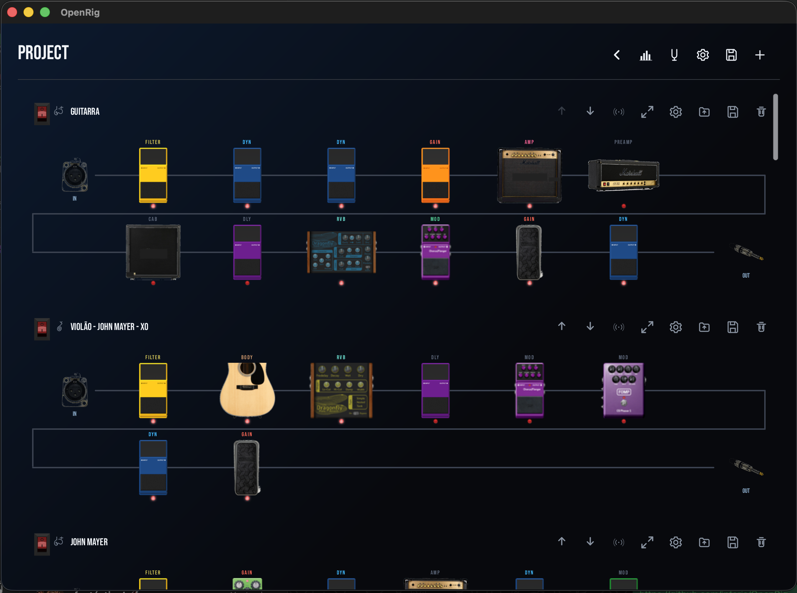
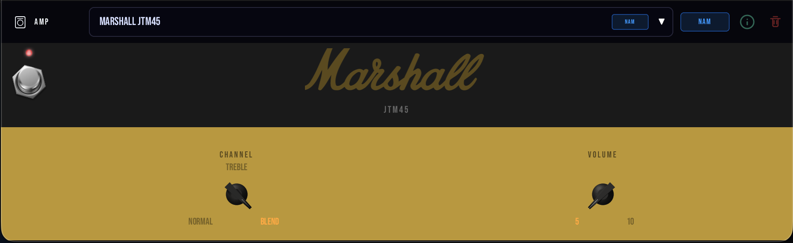

<p align="center">
  
</p>

<p align="center">
  <strong>Monte seu rig uma vez. Use em qualquer lugar.</strong>
</p>

<p align="center">
  <a href="LICENSE"></a>
  
  
  
  <a href="https://github.com/jpfaria/OpenRig/actions/workflows/test.yml"></a>
  <a href="https://codecov.io/gh/jpfaria/OpenRig"></a>
</p>

<p align="center">
  <a href="README.md">English</a> · <strong>Português</strong> · <a href="README.es-ES.md">Español</a>
</p>

<p align="center">
  
</p>

---

> **Áudio profissional não devia caber em uma caixa preta.**

OpenRig é uma plataforma open source de processamento de áudio em tempo real escrita em Rust. **O software é o produto. O hardware é só onde ele roda.**

## Por que o OpenRig existe

Se você quer processamento de guitarra de nível profissional hoje, você compra uma caixa preta. Helix, Quad Cortex, Axe-Fx — milhares de dólares por músico. Firmware fechado. O que veio na caixa é o que você tem, e é o que você nunca vai poder mudar.

Multiplique isso por uma banda inteira e a conta para de fechar.

OpenRig nasceu de uma pergunta simples:

> E se um único nó processasse o som da banda inteira, e cada músico controlasse a sua própria chain pelo celular?

Imagina o palco. Guitarra, baixo, teclado, vocal — todos plugados em um único nó. Esse nó pode ser uma pedaleira no chão, uma caixinha dentro do gig bag, ou um desktop nos bastidores. **O form factor não importa. O software é o mesmo.**

Cada músico abre o app no celular ou tablet e controla a sua própria chain de efeitos. Quem prefere hardware pluga uma pedaleira que é só um terminal — conectada via USB, Bluetooth, ou rede via gRPC. Só uma pessoa da banda precisa ter o hardware. O resto usa o que já tem no bolso.

Esse é o destino. Abaixo está o que já funciona, e o que vem em seguida.

## O que já roda hoje

A base que torna a visão maior possível já roda em todas as plataformas desktop:

- **App standalone** para macOS (Apple Silicon + Intel), Linux (x86_64 + aarch64) e Windows (x86_64).
- **Chains verdadeiramente paralelas.** Cada input é um runtime de áudio isolado — sem buffer compartilhado, sem lock contestado, sem CPU spike entre streams. Duas guitarras na mesma interface? Dois rigs completamente independentes no mesmo projeto, processados em paralelo.
- **[560+ modelos registrados](docs/user-guide/blocks-reference.md#model-id-quick-reference)** distribuídos em 16 tipos de bloco — preamps, amps, cabs, pedais de overdrive/distorção/fuzz/boost, delays, reverbs, modulation, dynamics, filtros, wah, correção de pitch e 114 IRs de body acústico para captadores piezo e magnéticos. ([catálogo completo com IDs canônicos](docs/user-guide/blocks-reference.md))
- **Quatro backends de áudio no mesmo grafo.** DSP nativo em Rust para utility, EQ, dynamics, modulation e reverb. NAM (Neural Amp Modeler) com capturas neurais de hardware real — Marshall Plexi, Mesa Rectifier, EVH 5150, Vox AC30, Klon Centaur, Boss DS-1, Big Muff e mais 540+. Convolução por IR para cabinets e bodies acústicos. 100+ plugins LV2 já embutidos (Guitarix, MDA, TAP, ZAM, Dragonfly e outros). Qualquer bloco em uma chain pode vir de qualquer backend.
- **Visualização em tempo real embutida.** Um afinador cromático e um analisador de espectro ao vivo entram na chain como qualquer outro bloco — veja o que você ouve.
- **Formato de preset YAML aberto.** Presets são texto puro — diffáveis, compartilháveis por gist, scriptáveis. A skill [`openrig-tone-builder`](.claude/skills/openrig-tone-builder/SKILL.md) do Claude Code monta presets completos a partir de uma música, pesquisando o signal chain original em fontes públicas e escrevendo o YAML.

> 📚 **Procurando um amp, pedal ou cab específico?** O catálogo completo — todo modelo, todo parâmetro, toda variante de voicing, com strings canônicas de `MODEL_ID` para usar no preset YAML — está documentado em **[Blocks Reference](docs/user-guide/blocks-reference.md)**. Comece pelo [Model ID Quick Reference](docs/user-guide/blocks-reference.md#model-id-quick-reference), uma busca alfabética agrupada por tipo de bloco.

## Para onde vai

O desktop é a base. O produto é a **banda em um só nó**. O caminho:

- **Servidor gRPC** — para que clientes externos (celular, tablet, controlador dedicado, outra instância do OpenRig) possam controlar suas próprias chains pela rede em tempo real.
- **App de celular e tablet** — a superfície de controle por músico. Abre, vê a chain, gira knobs.
- **Pedaleira como nó** — hardware classe Orange Pi rodando OpenRig com I/O de áudio embarcada e Linux de baixa latência por baixo.
- **Pedaleira como terminal** — o mesmo hardware roda como controlador físico de um nó remoto, falando USB / Bluetooth / rede.
- **Projetos multi-músico** — um nó hospedando chains independentes e isoladas para guitarra, baixo, teclado, vocal — cada uma controlada por uma superfície diferente.

Mesmo software em qualquer form factor. O timbre do usuário vai junto — desktop hoje, gig bag amanhã, pedaleira no palco, servidor no estúdio. Nada para reaprender. Nada para re-licenciar.

## Showcase

<p align="center">
  &nbsp;&nbsp;&nbsp;
  
</p>

Esquerda: biblioteca de blocos, organizada por marca com arte de painel fiel ao hardware. Direita: editor por bloco em uma captura do Marshall JTM45 — controles exatos, resposta exata.

## Início rápido

1. **Instale** — [baixe um release](https://github.com/jpfaria/OpenRig/releases/latest) para sua plataforma, ou compile do código (veja abaixo).
2. **Configure I/O** — escolha sua interface de áudio como input e seus monitores/fones como output.
3. **Monte uma chain** — arraste blocos entre Input e Output (Tuner → EQ → Drive → Amp → Cab → Reverb é um bom começo).
4. **Ajuste em tempo real** — clique em qualquer bloco para abrir o editor; gire knobs enquanto toca.
5. **Salve um preset** — presets são YAML puro em `~/.openrig/presets/` (macOS/Linux) ou `%APPDATA%\OpenRig\presets\` (Windows). Compartilhe copiando e colando.

Walkthrough completo: [Quick Start Guide](docs/user-guide/quick-start.md).

## Monte seu timbre

Um preset é só YAML. Aqui o início de uma chain rhythm estilo Frusciante de "Can't Stop":

```yaml
id: red_hot_chili_peppers_-_cant_stop_-_rhythm
name: Red Hot Chili Peppers - Can't Stop (Rhythm)
blocks:
  - type: gain
    enabled: true
    model: cc_boost            # MXR Micro Amp clean boost
    params: {}
  - type: gain
    enabled: true
    model: boss_ds1            # Proxy do Boss DS-2: tone 7, dist 5
    params: { tone: 7, dist: 5 }
  - type: modulation
    enabled: true
    model: ensemble_chorus     # CE-1 Chorus Ensemble
    params: { rate_hz: 0.55, depth: 22.0, mix: 25.0 }
  - type: amp
    enabled: true
    model: marshall_super_100_1966   # Proxy do Marshall Major
    params: {}
  # ...EQ pós-amp, reverb, limiter, master volume
```

Todo `model:` ID está registrado no [Blocks Reference Quick Reference](docs/user-guide/blocks-reference.md#model-id-quick-reference). Para usuários do Claude Code, a skill [`openrig-tone-builder`](.claude/skills/openrig-tone-builder/SKILL.md) gera a chain completa só a partir de artista + música.

## Instalação

### Download

Releases para todas as plataformas suportadas (macOS aarch64/x86_64, Linux x86_64/aarch64, Windows x86_64) são publicados na [página de Releases](https://github.com/jpfaria/OpenRig/releases/latest).

### Compilar do código

```bash
git clone https://github.com/jpfaria/OpenRig.git
cd OpenRig
git submodule update --init --recursive
cargo build --release -p adapter-gui
```

Veja o [Installation Guide](docs/user-guide/installation.md) para dependências por plataforma e troubleshooting.

## Documentação

### Para músicos

- [Installation Guide](docs/user-guide/installation.md) — baixar, compilar, configurar
- [Quick Start](docs/user-guide/quick-start.md) — primeiro projeto e signal chain
- [Blocks Reference](docs/user-guide/blocks-reference.md) — todo modelo com IDs canônicos e parâmetros
- [Presets](docs/user-guide/presets.md) — criar, salvar, compartilhar

### Para desenvolvedores

- [Architecture](docs/development/architecture.md) — mapa de crates, layers, design patterns
- [Building](docs/development/building.md) — guia de build completo, incluindo o engine NAM e Docker
- [Creating Blocks](docs/development/creating-blocks.md) — como adicionar novos modelos de áudio
- [Audio Backends](docs/development/audio-backends.md) — internos de Native, NAM, IR e LV2

## Contribuindo

OpenRig é aberto por intenção — contribuições são bem-vindas e a arquitetura foi feita para deixar isso tratável. O processamento de áudio é separado por tipo de bloco, então cada modelo é totalmente dono do seu crate, com zero acoplamento entre capturas brand-específicas e o resto do sistema. O projeto segue [Gitflow](https://nvie.com/posts/a-successful-git-branching-model/) com padrões estritos de qualidade: zero warnings, zero acoplamento, single source of truth.

Veja [CONTRIBUTING.md](CONTRIBUTING.md) para branching, commits, PRs e padrões de código.

## Roadmap

Todo item aberto abaixo é rastreado como uma [issue do GitHub](https://github.com/jpfaria/OpenRig/issues) — é onde o progresso, a discussão de design e os PRs vivem. Star ou watch no repo para acompanhar.

### Hoje

- [x] App standalone para **macOS** (Apple Silicon + Intel), **Linux** (x86_64 + aarch64) e **Windows** (x86_64) — cinco alvos de plataforma a partir de um único codebase
- [x] **Chains verdadeiramente paralelas** — cada input é um runtime de áudio isolado, sem buffer compartilhado, sem lock contestado, sem CPU spike entre streams
- [x] **[560+ modelos](docs/user-guide/blocks-reference.md#model-id-quick-reference)** em 16 tipos de bloco, com **quatro backends de áudio** (Native DSP, NAM, IR, LV2) coexistindo no mesmo grafo em tempo real
- [x] **I/O de áudio nativo em todas as plataformas** — Core Audio (macOS), ALSA + JACK (Linux), WASAPI (Windows)
- [x] **Afinador cromático em tempo real** como bloco first-class — solta em qualquer ponto da chain
- [x] **Analisador de espectro em tempo real** como bloco first-class — veja o que você ouve
- [x] **UI multi-idioma** — 9 línguas hoje: inglês (`en-US`), português (`pt-BR`), espanhol (`es-ES`), francês (`fr-FR`), alemão (`de-DE`), japonês (`ja-JP`), coreano (`ko-KR`), chinês simplificado (`zh-CN`) e hindi (`hi-IN`); o framework de i18n está pronto para contribuições da comunidade
- [x] **Filtragem por instrumento por chain** — guitarra elétrica, violão, baixo, voz, teclado, bateria ou genérico — só os blocos relevantes aparecem
- [x] **Múltiplos blocos de I/O por chain** com configuração independente de dispositivo e canal por bloco
- [x] **Bypass por bloco** — todo bloco pode ser ligado ou desligado ao vivo sem reconstruir a chain
- [x] **Loaders de IR e NAM do usuário** — solta qualquer arquivo `.wav` de impulso ou captura `.nam` na chain em runtime
- [x] **Formato de preset YAML aberto** — diffável, compartilhável por gist, scriptável; registry canônico de `MODEL_ID` documentado em [Blocks Reference](docs/user-guide/blocks-reference.md)
- [x] **Construção de preset assistida por IA** — a skill [`openrig-tone-builder`](.claude/skills/openrig-tone-builder/SKILL.md) do Claude Code vem no repo e escreve presets completos a partir de uma música ou artista

### Features de palco

- [ ] Snapshots / cenas ([#321](https://github.com/jpfaria/OpenRig/issues/321))
- [ ] Setlist / modo live performance ([#325](https://github.com/jpfaria/OpenRig/issues/325))
- [ ] Looper, multi-camada ([#323](https://github.com/jpfaria/OpenRig/issues/323))
- [ ] Backing tracks / player de áudio ([#324](https://github.com/jpfaria/OpenRig/issues/324))
- [ ] Mapeamento de pedal de expressão via MIDI CC ([#326](https://github.com/jpfaria/OpenRig/issues/326))
- [ ] Tap tempo global / BPM por preset ([#322](https://github.com/jpfaria/OpenRig/issues/322))
- [ ] Roteamento paralelo / splits de chain ([#328](https://github.com/jpfaria/OpenRig/issues/328))
- [ ] A/B compare ([#327](https://github.com/jpfaria/OpenRig/issues/327))
- [ ] Master mixer por stream ([#344](https://github.com/jpfaria/OpenRig/issues/344))

### Fundação sonora

- [ ] Reescrita de DSP nativo de cada tipo de bloco a partir de papers, sem dependência de captura externa ([#380](https://github.com/jpfaria/OpenRig/issues/380) umbrella, com sub-issues [#381–#392](https://github.com/jpfaria/OpenRig/issues?q=is%3Aopen+is%3Aissue+label%3Acore+38))
- [ ] Modelos manuais por componente para os amps benchmark do OpenRig ([#347](https://github.com/jpfaria/OpenRig/issues/347))
- [ ] Geradores NAM → nativo para amps e preamps ([#282](https://github.com/jpfaria/OpenRig/issues/282), [#283](https://github.com/jpfaria/OpenRig/issues/283))
- [ ] Geradores IR → nativo para cabinets e bodies acústicos ([#284](https://github.com/jpfaria/OpenRig/issues/284), [#285](https://github.com/jpfaria/OpenRig/issues/285))
- [ ] Wizard de plugin do usuário para import NAM / IR ([#287](https://github.com/jpfaria/OpenRig/issues/287))

### Ecossistema e remoto

- [ ] Servidor gRPC para controle remoto de chain pela rede
- [ ] App de celular e tablet como superfície de controle por músico
- [ ] Form factor pedaleira — hardware classe Orange Pi, Linux de baixa latência
- [ ] Pedaleira como terminal — controlador USB / Bluetooth / rede para nós remotos
- [ ] Projetos multi-músico em um único nó
- [ ] `openrig-cli` — cliente CLI scriptável via gRPC ([#298](https://github.com/jpfaria/OpenRig/issues/298))
- [ ] OpenRig Hub — marketplace comunitário de plugins ([#309](https://github.com/jpfaria/OpenRig/issues/309))
- [ ] Plugin VST3 / AU

### Expansão de catálogo

Os 560+ modelos atuais são a semente. A expansão por bloco é rastreada sob a [label `planned`](https://github.com/jpfaria/OpenRig/issues?q=is%3Aopen+is%3Aissue+label%3Aplanned), incluindo um pipeline comunitário de import de LV2/VST3 ([#372](https://github.com/jpfaria/OpenRig/issues/372), [#374](https://github.com/jpfaria/OpenRig/issues/374), [#379](https://github.com/jpfaria/OpenRig/issues/379)) e a integração em massa do Airwindows ([#373](https://github.com/jpfaria/OpenRig/issues/373)).

## Licença

OpenRig é licenciado sob a [GNU General Public License v3.0](LICENSE) — o rig que você monta é seu. Para sempre.
