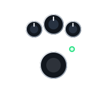
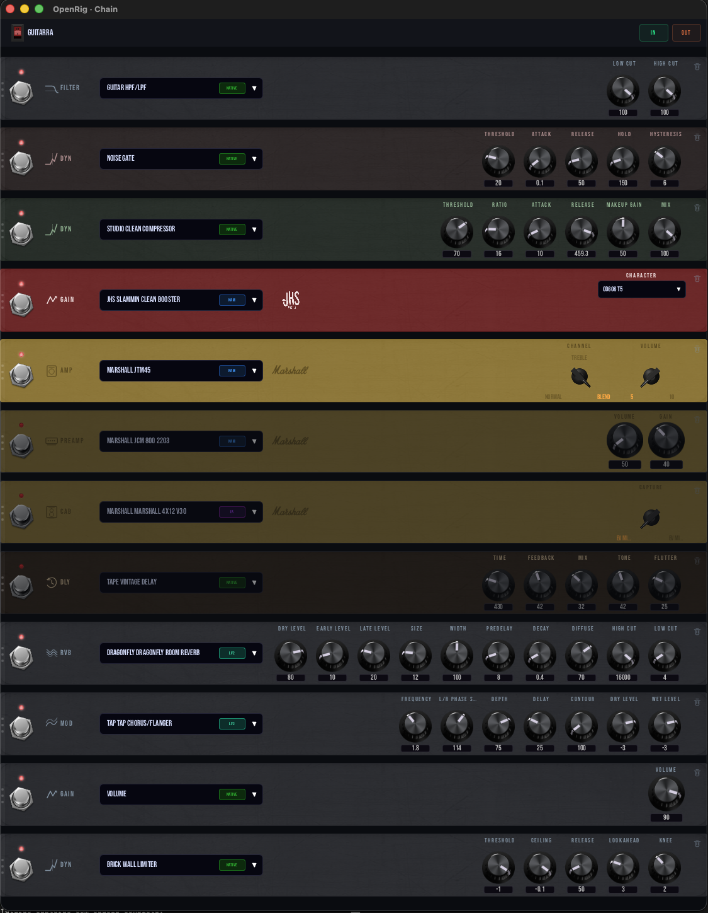

<p align="center">
  
</p>

<p align="center">
  <strong>Build your rig once. Use it everywhere.</strong>
</p>

<p align="center">
  <a href="LICENSE"></a>
  
  
  
  <a href="https://github.com/jpfaria/OpenRig/actions/workflows/test.yml"></a>
  <a href="https://codecov.io/gh/jpfaria/OpenRig"></a>
</p>

<p align="center">
  
</p>

---

> **Professional audio shouldn't live inside a black box.**

OpenRig is an open-source real-time audio platform written in Rust. **The software is the product. The hardware is just where it runs.**

## Why OpenRig exists

If you want professional guitar processing today, you buy a black box. Helix, Quad Cortex, Axe-Fx — thousands of dollars per musician. Closed firmware. What shipped in the box is what you get, and what you'll never be allowed to change.

Multiply that by an entire band and the math stops working.

OpenRig started from a simple question:

> What if a single node processed the audio of the whole band, and each musician controlled their own chain from their phone?

Picture the stage. Guitar, bass, keys, vocals — all plugged into one node. That node can be a pedalboard on the floor, a small box in a gig bag, or a desktop backstage. **The form factor doesn't matter. The software is the same.**

Each musician opens an app on their phone or tablet and controls their own effect chain. Anyone who prefers hardware plugs in a pedalboard that's just a terminal — connected over USB, Bluetooth, or network via gRPC. Only one person in the band needs the hardware. The rest use what's already in their pocket.

That's the destination. Below is what already works, and what's coming next.

## What runs today

OpenRig is on `v0.1.0-dev` — early, but real. The foundation that makes the bigger vision possible already runs in production on every desktop platform:

- **Standalone desktop app** for macOS (Apple Silicon + Intel), Linux (x86_64 + aarch64), and Windows (x86_64).
- **Truly parallel chains.** Each input is an isolated audio runtime — no shared buffers, no contended locks, no cross-stream CPU spikes. Two guitars on the same interface? Two completely independent rigs in the same project, processed in parallel.
- **560+ registered models** across 16 block types — preamps, amps, cabs, overdrive/distortion/fuzz/boost pedals, delays, reverbs, modulation, dynamics, filters, wah, pitch correction, and 114 acoustic body IRs for piezo/magnetic acoustic pickups.
- **Four audio backends in the same graph.** Native Rust DSP for utility, EQ, dynamics, modulation, and reverb. NAM (Neural Amp Modeler) neural captures of real hardware — Marshall Plexi, Mesa Rectifier, EVH 5150, Vox AC30, Klon Centaur, Boss DS-1, Big Muff, and 540+ more. IR convolution for cabinets and acoustic bodies. 100+ bundled LV2 plugins (Guitarix, MDA, TAP, ZAM, Dragonfly, and others). Every block in a chain can come from any backend.
- **Real-time visualization built in.** A chromatic tuner and a live spectrum analyzer drop into the chain like any other block — see what you hear.
- **Open YAML preset format.** Presets are plain text — diffable, gist-shareable, scriptable. The [`openrig-tone-builder`](.claude/skills/openrig-tone-builder/SKILL.md) Claude Code skill builds full presets from a song name by researching the original signal chain in public sources and writing the YAML.

The full catalog (every model, every parameter, every voicing variant) lives in the [Blocks Reference](docs/user-guide/blocks-reference.md).

## Where it's going

Desktop is the foundation. The product is the **band on one node**. The path:

- **gRPC server** — so external clients (phone, tablet, dedicated controller, another OpenRig instance) can drive their own chains over the network in real time.
- **Mobile and tablet app** — the per-musician control surface. Open it, see your chain, turn knobs.
- **Pedalboard as a node** — Orange Pi-class hardware running OpenRig with audio I/O on board, low-latency Linux underneath.
- **Pedalboard as a terminal** — same hardware can run as a physical controller for a remote OpenRig node, talking USB / Bluetooth / network.
- **Multi-musician projects** — one node hosting independent, isolated chains for guitar, bass, keys, vocals — each controlled from a different surface.

Same software in every form factor. The user's tone goes with them — desktop today, gig bag tomorrow, pedalboard at the venue, server in the rehearsal space. Nothing to re-learn. Nothing to re-license.

## Showcase

<p align="center">
  &nbsp;&nbsp;&nbsp;
  
</p>

Left: block library, organized by brand with hardware-faithful panel art. Right: per-block editor on a Marshall JTM45 capture — exact controls, exact response.

## Quick Start

1. **Install** — [download a release](https://github.com/jpfaria/OpenRig/releases/latest) for your platform, or build from source (see below).
2. **Configure I/O** — pick your audio interface as input and your monitors/headphones as output.
3. **Build a chain** — drop blocks between Input and Output (Tuner → EQ → Drive → Amp → Cab → Reverb is a good start).
4. **Tweak in real time** — click any block to open its editor; turn knobs while you play.
5. **Save a preset** — presets are plain YAML in `~/.openrig/presets/` (macOS/Linux) or `%APPDATA%\OpenRig\presets\` (Windows). Share by copy-paste.

Full walkthrough: [Quick Start Guide](docs/user-guide/quick-start.md).

## Build Your Tone

A preset is just YAML. Here's the start of a Frusciante-style "Can't Stop" rhythm chain:

```yaml
id: red_hot_chili_peppers_-_cant_stop_-_rhythm
name: Red Hot Chili Peppers - Can't Stop (Rhythm)
blocks:
  - type: gain
    enabled: true
    model: cc_boost            # MXR Micro Amp clean boost
    params: {}
  - type: gain
    enabled: true
    model: boss_ds1            # Boss DS-2 proxy: tone 7, dist 5
    params: { tone: 7, dist: 5 }
  - type: modulation
    enabled: true
    model: ensemble_chorus     # CE-1 Chorus Ensemble
    params: { rate_hz: 0.55, depth: 22.0, mix: 25.0 }
  - type: amp
    enabled: true
    model: marshall_super_100_1966   # Marshall Major proxy
    params: {}
  # ...post-amp EQ, reverb, limiter, master volume
```

Every `model:` ID is registered in the [Blocks Reference Quick Reference](docs/user-guide/blocks-reference.md#model-id-quick-reference). For Claude Code users, the [`openrig-tone-builder`](.claude/skills/openrig-tone-builder/SKILL.md) skill generates the full chain from just an artist + song name.

## Installation

### Download

Releases for every supported platform (macOS aarch64/x86_64, Linux x86_64/aarch64, Windows x86_64) are published on the [Releases page](https://github.com/jpfaria/OpenRig/releases/latest).

### Build from Source

```bash
git clone https://github.com/jpfaria/OpenRig.git
cd OpenRig
git submodule update --init --recursive
cargo build --release -p adapter-gui
```

See the [Installation Guide](docs/user-guide/installation.md) for platform-specific dependencies and troubleshooting.

## Documentation

### For Musicians

- [Installation Guide](docs/user-guide/installation.md) — download, build, set up
- [Quick Start](docs/user-guide/quick-start.md) — first project and signal chain
- [Blocks Reference](docs/user-guide/blocks-reference.md) — every model with canonical IDs and parameters
- [Presets](docs/user-guide/presets.md) — create, save, share

### For Developers

- [Architecture](docs/development/architecture.md) — crate map, layers, design patterns
- [Building](docs/development/building.md) — full build guide including the NAM engine and Docker
- [Creating Blocks](docs/development/creating-blocks.md) — how to add new audio models
- [Audio Backends](docs/development/audio-backends.md) — Native, NAM, IR, and LV2 internals

## Contributing

OpenRig is open by intent — contributions are welcome and the architecture is designed to make them tractable. Audio processing is split per block type so each model is fully owned by its crate, with zero cross-coupling between brand-specific captures and the rest of the system. The project follows [Gitflow](https://nvie.com/posts/a-successful-git-branching-model/) with strict code quality standards: zero warnings, zero coupling, single source of truth.

See [CONTRIBUTING.md](CONTRIBUTING.md) for branching, commits, PRs, and code standards.

## Roadmap

Every open item below is tracked as a [GitHub issue](https://github.com/jpfaria/OpenRig/issues) — that's where progress, design discussion, and PRs live. Star or watch the repo to follow along.

### Today

- [x] Standalone desktop app (macOS, Linux, Windows)
- [x] Multi-input parallel chains with stream isolation
- [x] 560+ models across 16 block types, four audio backends in the same graph

### Stage features

- [ ] Snapshots / scenes ([#321](https://github.com/jpfaria/OpenRig/issues/321))
- [ ] Setlist / live performance mode ([#325](https://github.com/jpfaria/OpenRig/issues/325))
- [ ] Looper, multi-layer ([#323](https://github.com/jpfaria/OpenRig/issues/323))
- [ ] Backing tracks / audio player ([#324](https://github.com/jpfaria/OpenRig/issues/324))
- [ ] Expression pedal mapping over MIDI CC ([#326](https://github.com/jpfaria/OpenRig/issues/326))
- [ ] Global tap tempo / preset BPM ([#322](https://github.com/jpfaria/OpenRig/issues/322))
- [ ] Parallel routing / chain splits ([#328](https://github.com/jpfaria/OpenRig/issues/328))
- [ ] A/B compare ([#327](https://github.com/jpfaria/OpenRig/issues/327))
- [ ] Master mixer per stream ([#344](https://github.com/jpfaria/OpenRig/issues/344))

### Sound foundation

- [ ] Native DSP rewrites of every block type from first principles, papers and no external capture dependency ([#380](https://github.com/jpfaria/OpenRig/issues/380) umbrella, with sub-issues [#381–#392](https://github.com/jpfaria/OpenRig/issues?q=is%3Aopen+is%3Aissue+label%3Acore+38))
- [ ] Manual component models for the OpenRig benchmark amps ([#347](https://github.com/jpfaria/OpenRig/issues/347))
- [ ] NAM → native generators for amps and preamps ([#282](https://github.com/jpfaria/OpenRig/issues/282), [#283](https://github.com/jpfaria/OpenRig/issues/283))
- [ ] IR → native generators for cabinets and acoustic bodies ([#284](https://github.com/jpfaria/OpenRig/issues/284), [#285](https://github.com/jpfaria/OpenRig/issues/285))
- [ ] User-authored plugin wizard for NAM / IR import ([#287](https://github.com/jpfaria/OpenRig/issues/287))

### Ecosystem and remote

- [ ] gRPC server for remote chain control over the network
- [ ] Mobile and tablet app as the per-musician control surface
- [ ] Pedalboard form factor — Orange Pi-class hardware, low-latency Linux
- [ ] Pedalboard-as-terminal — USB / Bluetooth / network controller for remote nodes
- [ ] Multi-musician projects on a single node
- [ ] `openrig-cli` — scriptable CLI client over gRPC ([#298](https://github.com/jpfaria/OpenRig/issues/298))
- [ ] OpenRig Hub — community plugin marketplace ([#309](https://github.com/jpfaria/OpenRig/issues/309))
- [ ] VST3 / AU plugin

### Catalog expansion

The current 560+ models are the seed. Per-block expansion is tracked under the [`planned` label](https://github.com/jpfaria/OpenRig/issues?q=is%3Aopen+is%3Aissue+label%3Aplanned), including a community-driven LV2/VST3 import pipeline ([#372](https://github.com/jpfaria/OpenRig/issues/372), [#374](https://github.com/jpfaria/OpenRig/issues/374), [#379](https://github.com/jpfaria/OpenRig/issues/379)) and Airwindows mass integration ([#373](https://github.com/jpfaria/OpenRig/issues/373)).

## License

OpenRig is licensed under the [GNU General Public License v3.0](LICENSE) — the rig you build belongs to you. Forever.
