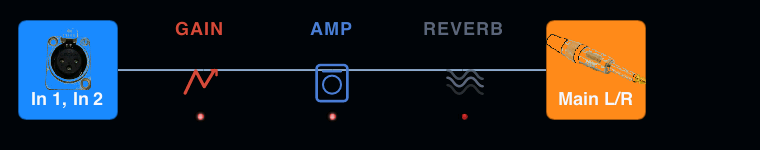
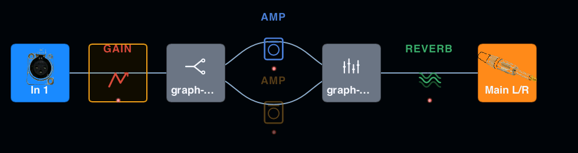
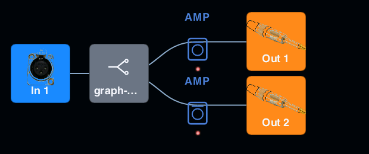

# GraphView — node-and-edge canvas with pan/zoom/drag

**Status:** introduced in #435; grown into the chain editor's canvas in #328.
**Source:** `crates/adapter-gui/ui/components/` — `graph_view.slint` (the canvas), `graph_node_card.slint` (one node card), `graph_wire.slint` (one wire), `graph_view_types.slint` (the structs) — and the Rust model in `crates/adapter-gui/src/graph_view_model/`.

A reusable Slint component for rendering a directed graph with full interactivity. Built first as a standalone primitive — integration with the existing chain UI (`secondary_windows_chain.slint`, `chain_chips.slint`) is a separate effort and not part of this component.

The visual language follows pedalboards in the **Helix / Quad Cortex / Mooer GE1000** family: grid-aligned nodes, explicit Bézier wires, parallel paths drawn on dedicated lanes. Not force-directed — signal chains are too structured for spring physics to give a stable result across reopens.

## When to use it

| You want… | Component? |
|---|---|
| Single signal chain with up to ~30 blocks, branched paths | **Yes** |
| Project topology (inputs → chains → outputs) | **Yes** (once #436 lands and you can feed it the project graph) |
| Arbitrary graph with hundreds of nodes, force-directed | Out of scope. Different layout algo, different perf budget. |
| Static diagram for docs | Overkill. Render to SVG offline. |

## Architecture

```
                ┌─ Rust ───────────────────────────────────────┐
                │                                              │
  domain  ───►  │  graph_view_model/                           │
   data         │   ChainStage[]  → linear_chain_layout()      │
                │   → (Vec<GraphNode>, Vec<GraphEdge>)         │
                │   → validate_graph()                         │
                │                                              │
                │  wiring code (per use site)                  │
                │   converts pure Rust → Slint structs         │
                │   resolves GraphEdge → GraphEdgeGeometry     │
                └──────────────────────────────────────────────┘
                                       │
                                       ▼ ModelRc<...>
                ┌─ Slint ──────────────────────────────────────┐
                │  GraphView component                         │
                │   renders nodes + Bezier wires               │
                │   handles pan/zoom/drag/click                │
                │   emits callbacks with layout-space coords   │
                └──────────────────────────────────────────────┘
```

**Two coordinate systems:**

| Space | Where | Computed how |
|---|---|---|
| Layout space | `GraphNode.layout_x/y`, `GraphEdgeGeometry.from/to_x/y`, all callback args | `linear_chain_layout()` (or by the host) |
| Viewport space | `x: pan_x + layout_x * zoom` inside Slint | applied per frame by the component |

The host **never** computes viewport coords — only emits layout coords. The component applies the transform.

## Slint API

### Structs

```slint
struct GraphNode {
    id: string;
    label: string;          // endpoint names on I/O cards; empty on split/mixer
    category: string;       // "drive", "amp", "reverb", "util", ...
    fill: color;            // host-resolved from default_palette()
    border: color;
    layout_x: length;
    layout_y: length;
    bypass: bool;
    selected: bool;
    kind: string;           // "block" | "io_input" | "io_output" | "split" | "mixer"
    neighbor: bool;         // MIDI neighbor marker (parity with BlockChip)
    block: ChainBlockItem;  // the chain row's item for a block card; empty otherwise
}

struct GraphEdgeGeometry {
    from_id: string;
    to_id: string;
    from_x: length;
    from_y: length;
    to_x: length;
    to_y: length;
}

struct GraphAnchor {        // one "+" on a wire (graph_view_model::insert_anchors)
    id: string;             // "stage:{i}" | "lane:{stage}:{lane}:{i}"
    layout_x: length;       // wire midpoint
    layout_y: length;
    always_visible: bool;   // empty segment: "+" shown without hover
}
```

`GraphEdgeGeometry` is the resolved form of an edge — coordinates are already looked up from the node list so Slint doesn't search per frame.

### Node kinds

`kind` picks the card face (#328): `block` — the block tile; `io_input` / `io_output` — connector artwork over the endpoint names (`label`); `split` / `mixer` — routing artwork (`ui/assets/graph-split.svg` / `graph-mix.svg`, text-free and colorized) over a translated name (`graph-node-split` / `graph-node-mixer`; the host leaves `label` empty). Every node is a clickable card: the earlier `label == "" && category == "util"` routing dot, which had no hit area, is gone. The canvas's accessible label is `@tr("accessible-graph-view")`.

### Block card parity

A `block` card draws what the chain row's `BlockChip` draws, from the same `ChainBlockItem` (`node.block`): type label, icon or thumbnail, the LED (driven by `bypass`), the amber unavailable tint at half opacity, the MIDI selected / neighbor markers, and the `BlockHoverTooltip` on hover (drawn by the canvas after every node, only for a block with a `display_name`, never during a drag). State colours come from `BlockTileStyle` (`ui/components/block_tile_style.slint`), the global `BlockChip` reads too. The canvas's node TouchArea sits UNDER the card, so the LED and the × win on their spots and the rest of the card clicks and drags through. The LED and × hit zones scale with the zoom.

### Properties

| Property | Direction | Type | Default | Purpose |
|---|---|---|---|---|
| `nodes` | `in` | `[GraphNode]` | — | nodes to render |
| `edges` | `in` | `[GraphEdgeGeometry]` | — | resolved edges to render |
| `anchors` | `in` | `[GraphAnchor]` | — | the "+" insert anchors, one per wire, drawn as the chain row's `BlockInsertSlot` without its track, over the nodes so a dragged card never hides the lit target |
| `zoom` | `in-out` | `float` | `1.0` | viewport scale, clamped to `[min_zoom, max_zoom]` |
| `pan_x`, `pan_y` | `in-out` | `length` | `0px` | viewport offset |
| `node_width`, `node_height` | `in` | `length` | `100px` × `100px` | per-node card size in layout space — the chain row's BlockChip size |
| `background_color` | `in` | `color` | `#11141a` | canvas background |
| `grid_color` | `in` | `color` | `#1a1f2a` | grid hint colour |
| `show_grid` | `in` | `bool` | `true` | render origin-cross grid hint |
| `markers_visible` | `in` | `bool` | `false` | show the MIDI selected / neighbor markers on block cards (#591) |
| `min_zoom`, `max_zoom` | `in` | `float` | `0.3`, `3.0` | zoom limits |

### Callbacks

| Callback | Args | When |
|---|---|---|
| `node_clicked(string)` | node id | press + release within 5 px (no drag) |
| `node_double_clicked(string)` | node id | double click on a node |
| `node_dragged(string, length, length)` | id, new layout-space x, y | continuously while drag in progress |
| `node_drag_ended(string, length, length)` | id, layout x, y | on mouse up after drag |
| `viewport_changed(float, length, length)` | zoom, pan_x, pan_y | after pan release or wheel zoom step |
| `bypass-toggled(string)` | node id | a block card's LED was clicked (#328) |
| `remove-requested(string)` | node id | a block card's × was clicked; the × is live only while the card is hovered, so a touch tap never removes (#328) |
| `add-requested(string)` | anchor id | a "+" was clicked — the host opens the add-block picker for that slot |
| `node-dropped(string, string)` | node id, anchor id | a dragged block was released on an anchor; fired after `node_drag_ended` |
| `resolve-drop-anchor(string, length, length) -> string` | node id, layout x, y | `pure` — the host answers which anchor a drag at (x, y) lands on (`""` = none) by calling `graph_view_model::resolve_drop_anchor`; asked on every drag move so the target lights up |

The host receives layout-space coords. To persist a moved node, write them back into `nodes` — the Slint side reads positions reactively.

## Rust helpers (`graph_view_model`)

| Item | What it does |
|---|---|
| `GraphNode` | pure Rust mirror of the Slint struct |
| `GraphEdge` | source/target id pair (no geometry) |
| `NodeCategory` | enum of visual categories — `as_str()` produces the slug the Slint side expects |
| `NodeKind` | what a node IS — `Block`, `IoInput`, `IoOutput`, `Split`, `Mixer`; `as_str()` gives the slug the Slint `GraphNode.kind` carries. The auto-generated split node is `Split`, the merge node `Mixer`; `BlockBlueprint::with_kind` marks the host's I/O nodes |
| `BlockBlueprint` | one block in a logical chain — id, label, category, bypass |
| `ChainStage` | `Single(...)` or `Parallel { lanes, end }` — `lanes` top to bottom |
| `ParallelEnd` | `Merge`: the lanes meet again at an auto-generated merge node. `Fan`: no merge node; each lane's last blueprint is its terminal (a Y chain's output node), the terminals share the last column, and nothing may follow (#328) |
| `GridMetrics` | column/lane spacing + origin |
| `linear_chain_layout(stages, metrics)` | builds positioned nodes + edges, inserts split/merge utility nodes for parallel stages |
| `validate_graph(nodes, edges)` | returns error strings (empty = valid). Catches duplicate ids, dangling edges, self-loops. |
| `validate_stages(stages)` | returns error strings for a stage list: a stage after a `Fan`, an empty `Fan` lane |
| `insert_anchors(stages, nodes)` | one `GraphAnchor` per wire of `linear_chain_layout`'s output, at the wire midpoint: `id` (`stage:{i}` / `lane:{stage}:{lane}:{i}`), the `AnchorSlot` a block added or dropped there lands in (index in the ORIGINAL list, "insert before"), and `always_visible` for an empty segment (no block at either end) |
| `resolve_drop_anchor(nodes, anchors, dragged_id, x, y, metrics)` | the anchor a block dragged to layout `(x, y)` lands on: the nearest one within half a column. `None` when that nearest one is on the block's own wire (no move), when the dragged node is not a `Block`, or when nothing is in reach. The canvas asks through its `resolve-drop-anchor` pure callback |

`linear_chain_layout` is pure — same input, same output. Used in tests + at runtime to compute positions from a logical chain description. Splits and merges are auto-generated with id prefix `__split_N` / `__merge_N` (a `Fan` has no `__merge_N`). `topological_layout` (auto mode) moves every terminal — a node with inputs and no outputs — to the last column, so a fan-out's terminals stay side by side there too.

## Category → colour mapping

The component owns no colours. The host resolves each node's `fill`/`border` from `default_palette()` (Rust, `graph_view_model/palette.rs`, the single source of truth) and writes them onto the node; they paint the I/O, split and mixer cards. Adding a category is one `NodeCategory` variant, its `as_str()` slug and one palette entry. Block cards do not use `fill`/`border`: they paint their states from `BlockTileStyle`, shared with `BlockChip`.

## Interactivity contract

- **Pan:** drag on empty canvas. Cursor turns `grab`. Released → fires `viewport_changed`.
- **Zoom:** Cmd (macOS) or Ctrl (Windows, Linux) + scroll wheel over the canvas — Slint reports both as `modifiers.control`. Zooms around the cursor (the point under the cursor stays fixed in layout space). Clamped to `[min_zoom, max_zoom]`. Fires `viewport_changed`.
- **Plain wheel:** not accepted. The canvas rejects it so the scroll area around the graph (the chains list, #328) scrolls instead.
- **Drag a node:** press on a node card, move beyond 5 px. Fires `node_dragged` continuously, `node_drag_ended` on release.
- **Drop on an anchor:** while a block is dragged the canvas asks `resolve-drop-anchor` on every move and highlights that "+"; releasing there fires `node-dropped(node, anchor)`. A drop on the block's own wire, or on nothing, fires no `node-dropped` (the drag still ends).
- **Click vs drag:** total displacement < 5 px in viewport space → `node_clicked`. Threshold is a `private property` so it can be retuned without changing the API.
- **Double-click:** fires `node_double_clicked` — host opens the block editor.

## What this component is NOT responsible for

| Concern | Where it lives instead |
|---|---|
| Persisting moved nodes | host (write back into `nodes` on `node_drag_ended`) |
| Block editor | existing `BlockEditorPanel` — host wires `node_double_clicked` to it |
| Real-time audio meters on nodes | future `GraphNodeMeter` overlay component |
| Edge routing avoidance (no crossings) | future — current Bézier is naive |
| Touch gestures (pinch-to-zoom) | future — Cmd/Ctrl + wheel only for now |

## Invariants

- **Audio thread:** untouched. This is pure UI. ✅ invariant #4/#8 of `CLAUDE.md`.
- **Allocations per frame:** none — `for` loops bind to the model, no `set_*` in render path.
- **Cross-platform:** no `cfg`-gated logic, no hardcoded paths. ✅
- **No mock audio:** this component doesn't process audio. N/A.

## Tests

Rust model — `crates/adapter-gui/src/graph_view_model_tests.rs`, `graph_view_model_anchor_tests.rs`, `graph_view_model_drop_tests.rs` (`cargo test -p adapter-gui --lib graph_view_model`):

- stage layout: singles; merge parallels (split + merge nodes, symmetric lanes, merge column); fan parallels (no merge node, one terminal per lane on a shared last column, path A above path B)
- `validate_stages` (nothing after a fan, no empty fan lane) and `validate_graph` (duplicate ids, dangling edges, self-loops; layout output always valid)
- node kinds (`as_str` slugs, a blueprint's kind reaches its node, split/mixer kinds)
- auto layout (ranks, lanes, reorder, fan terminals aligned)
- anchors (one per wire, slots, midpoints, empty segments visible)
- drop resolution (nearest anchor, cross-lane, own wire = none, blocks only, reach)

Slint — REAL pointer, wheel and key events through `i-slint-backend-testing` against `GraphViewHarness` / `GraphViewScrollHarness` (`ui/components/graph_view_test_harness.slint`), in `crates/adapter-gui/tests/issue_328_graph_view_interaction.rs`:

- click vs drag; every node kind is a clickable card
- a plain wheel scrolls the surrounding list, Cmd/Ctrl + wheel zooms
- the LED toggles bypass, the × removes (hover only), both hit zones scale with the zoom, the tooltip shows on hover, an unavailable block reads as disabled
- a "+" fires `add-requested`; a block dragged onto another lane's anchor fires `node-dropped`; a drop on its own wire fires nothing

Source pins — `tests/issue_328_graph_view_sources.rs`: the file split, no empty-label routing dots, translated accessible labels, text-free split/mixer artwork, block tile colours from `BlockTileStyle`.

Render — `ui/components/_harness_graph_view.slint` (not compiled into the app): `LinearChain`, `LinearChainZoomedOut`, `SplitMixChain`, `SplitYChain`, rendered with `tools/slint-render` (command in the `openrig-tooling` skill). The interpreter has no translation catalog, so `@tr` text renders as its key.

## Chain row (#328)

Every desktop chain row hosts a `GraphView` through `ui/pages/chain_row_graph.slint`
(`ChainRow` keeps the pedal strip for touch mode, `ChainGraphBridge.graph-enabled`).

| Linear | Split → Mix | Y → A/B |
|---|---|---|
|  |  |  |

- `src/chain_graph_adapter.rs` turns a `Chain` into `ChainStage`s: stage 0 is the input
  node, every top-level block one stage, each split one `Parallel { lanes: [A, B], end }`
  stage (`Merge` for Split → Mix, `Fan` for Y → A/B with each lane ending in its own output
  node), then the output node. A chain with a Mix, then a Y has two parallel stages in that
  order. Cards sit 132 px apart, lanes 108 px apart.
- `src/chain_graph_ids.rs` names the nodes: a block node is its `BlockId`; the fixed ids
  are `__io_input`, `__io_output`, `__io_output_a`, `__io_output_b`. The n-th split of the
  chain (1-based, top-level order) is `__split_n` and, for a Mix, its mixer `__merge_n`;
  `resolve_node` turns them back into the split's `BlockId`.
- `src/chain_graph_models.rs` publishes the nodes (each block node with its strip tile in
  `GraphNode.block`), the wires and the "+" anchors on `ProjectChainItem.graph_*` once per
  row rebuild; the meter tick never rebuilds them.
- `src/graph_anchor.rs` turns an anchor id (`stage:{i}` / `lane:{stage}:{lane}:{i}`) back
  into a position plus a split path — where a "+" inserts and where a drop moves a block.
- The #591 MIDI markers follow `ChainGraphBridge.selected-block-id` / `neighbor-block-id`
  (`GraphView.selected-node-id` / `neighbor-node-id`), fed from the same `SelectionState` the
  strip reads, so a row rebuild never loses them.
- Every gesture reaches Rust through `ChainGraphBridge`, tagged with the row's chain index;
  `resolve-drop-anchor` is answered by `graph_view_model::resolve_drop_anchor`.

## Future work

Captured here so the next contributor doesn't reinvent it:

- **Routing avoidance:** Bézier wires currently cross when paths zig-zag. Use a layered routing algorithm (Manhattan or orthogonal-with-bends).
- **Keyboard navigation:** Tab/arrow to move focus between nodes, Enter for click, Shift+Enter for double-click. `petgraph` can supply BFS/DFS over the graph if we add it as a dep.
- **Persist viewport** between sessions per chain.
- **Meter overlays** on amp/dynamics nodes for live signal level.
- **Multi-select** with drag-rectangle for bulk operations.
- **Snap-to-grid** during drag.
