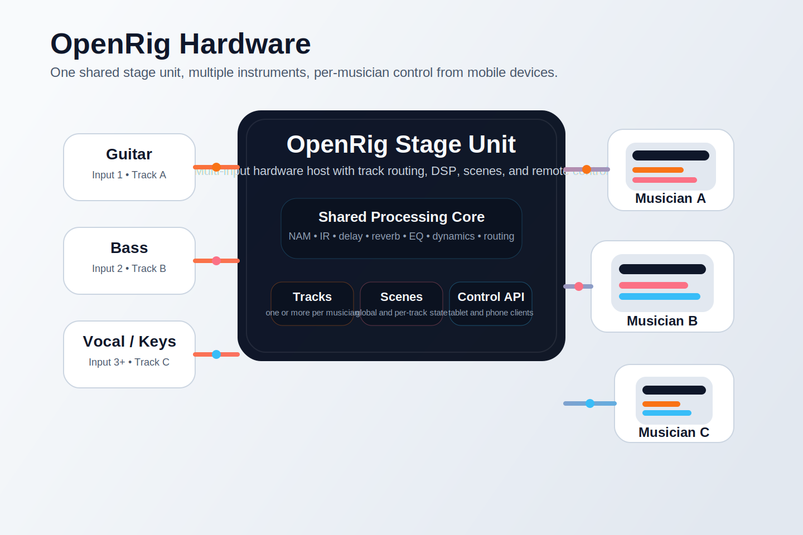

# OpenRig Hardware

If you want generated marketing images instead of diagrams, use the prompts in [image-prompts.md](image-prompts.md).

## Goal

OpenRig hardware is intended to be a shared stage unit that can receive one or more instruments at the same time and still let each musician control only their own track from a phone or tablet.

The core idea is:

- one physical hardware host on stage
- multiple audio inputs
- one or more tracks per musician
- remote control from personal mobile devices
- a shared DSP engine with isolated control surfaces

## Core Scenario

A band can connect guitar, bass, vocals, keys, or other inputs into the same OpenRig hardware unit.

Inside the unit:

- each input is routed to one or more tracks
- each track owns its own chain of blocks, scenes, and state
- the hardware runs the audio engine locally
- mobile clients connect over the network to inspect and control assigned tracks

This allows a single box to act as the live processing hub while preserving personal control for each player.

## Control Model

Each musician should be able to control their own track from a phone or tablet without changing the rest of the band setup.

That implies a control model with:

- track identity
- musician identity or session identity
- permissions per track or track group
- local hardware controls for global actions
- remote UI controls for personal edits and live toggles

Examples:

- Guitarist controls drive, delay, reverb, tuner, scenes for Track A
- Bass player controls compression, EQ, amp model, scenes for Track B
- Singer controls vocal chain or monitor-specific processing for Track C
- Band leader or tech controls global scenes and hardware-level routing

## Hardware Responsibilities

The dedicated hardware unit is expected to own:

- audio input and output devices
- DSP runtime execution
- preset and setup loading
- state synchronization
- networked control endpoints
- optional local screen and foot control workflow

In other words, the hardware is not just a remote terminal. It is the actual runtime host.

## Remote Device Responsibilities

Phones and tablets are not responsible for audio processing.

They are responsible for:

- browsing assigned tracks
- changing parameters
- toggling blocks
- loading musician-facing scenes
- reading status from the hardware

This keeps the audio path stable even if a mobile device disconnects.

## Multi-Track Design Implications

To support this model cleanly, the system should continue to evolve around:

- explicit track ownership
- independent track state
- control API abstractions instead of UI-specific logic
- transport-agnostic adapters for desktop, mobile, hardware screen, and plugin GUI
- setup models that can describe multiple inputs, outputs, and musician assignments

## Product Direction

This hardware mode is not separate from the rest of OpenRig. It uses the same core architecture as:

- standalone desktop mode
- VST3 plugin mode
- server mode

The difference is the host environment, local control surface, and network role.

That is the point of the platform: one engine, multiple runtime forms.
